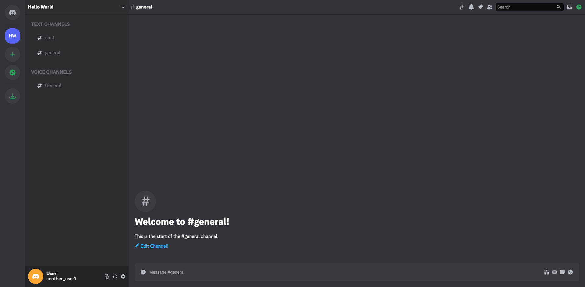

# Discord UI

[Challenge](https://github.com/CodingGarden/discord-ui-challenge) set by [Coding Garden](https://github.com/CodingGarden/) to re-create the discord UI

Built with React / Vite
Icons Library used: react-icons

## TODO

* Hover Effects
* Emoji Sprite Animation
* Change icons library for SVGs
* Channel Component
